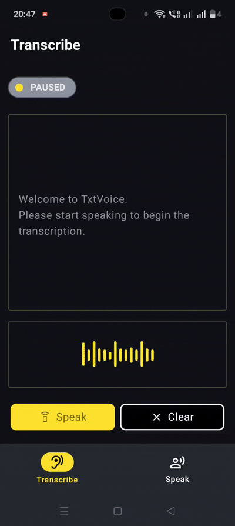
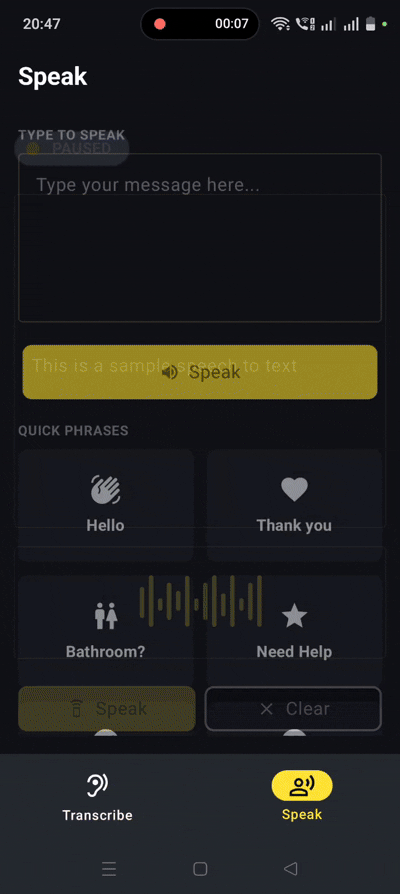

# TxtVoice

TxtVoice is an Android accessibility and communication application that provides real-time Speech-to-Text transcription and Text-to-Speech conversion using Android's native speech APIs. Built with Kotlin, Jetpack Compose, MVVM, Hilt, and Material 3.


---

## 🎥 Demo

### Quick Preview

<table>
<tr>
<td align="center">
<b>🎤 Live Transcribe</b>
</td>
<td align="center">
<b>🔊 Quick Speak</b>
</td>
</tr>

<tr>
<td align="center">

</td>

<td align="center">

</td>
</tr>
</table>

### Full Demo Video (with Audio)

[▶ Watch Demo Video](https://github.com/dhruva-b-dev/TxtVoice/blob/main/demo/txtvoice-demo.mp4)

---

## 📱 Screenshots

<table>
<tr>
<td align="center">
<b>Live Transcribe</b>
</td>
<td align="center">
<b>Quick Speak</b>
</td>
</tr>

<tr>
<td align="center">
Speech-to-Text
</td>
<td align="center">
Text-to-Speech
</td>
</tr>

<tr>
<td align="center">

</td>

<td align="center">

</td>
</tr>
</table>

---

## 🎯 Purpose

TxtVoice was built to explore Android's SpeechRecognizer and TextToSpeech APIs while implementing a modern Android architecture using Jetpack Compose, MVVM, Hilt, and StateFlow.

The application focuses on accessibility, communication assistance, and real-time speech interactions.

---

## 📚 Key Learnings

- Integrating Android SpeechRecognizer API
- Implementing TextToSpeech functionality
- Building reactive UIs with Jetpack Compose
- Managing UI state using StateFlow
- Applying MVVM architecture principles
- Dependency Injection with Hilt
- Navigation using Navigation Compose
- Designing accessibility-focused mobile experiences

## ✨ Features

### 🎤 Live Transcribe

- Real-time Speech-to-Text conversion
- Continuous speech recognition
- Pause and resume transcription
- Clear transcript instantly
- High accuracy speech recognition
- Clean accessibility-focused UI

### 🔊 Quick Speak

- Convert typed text into spoken audio
- Instant Text-to-Speech generation
- Predefined quick phrases
- Accessibility communication support
- Simple and intuitive interface

### 💬 Quick Phrases

- Hello
- Thank You
- Bathroom?
- Need Help
- Yes
- No

---

## ✅ Supported Features

| Feature | Status |
|----------|---------|
| Speech-to-Text | ✅ |
| Text-to-Speech | ✅ |
| Quick Phrases | ✅ |
| Real-time Transcription | ✅ |
| Pause / Resume Listening | ✅ |
| History Screen | ✅ |
| Settings Screen | ✅ |
| Multi-language Support | 📋 Planned |
| Export Transcript | 📋 Planned |
| Offline Recognition | 📋 Planned |

---

## 🏗️ Architecture

The application follows the MVVM (Model-View-ViewModel) architecture pattern.

```text
┌──────────────────────┐
│  Jetpack Compose UI  │
└──────────┬───────────┘
           │
           ▼
┌──────────────────────┐
│      ViewModel       │
└──────────┬───────────┘
           │
           ▼
┌──────────────────────┐
│    VoiceManager      │
└───────┬───────┬──────┘
        │       │
        ▼       ▼
SpeechRecognizer   TextToSpeech
      API              API
```

### Architecture Components

- **Jetpack Compose** for declarative UI
- **MVVM** for separation of concerns
- **StateFlow** for reactive state management
- **Hilt** for dependency injection
- **VoiceManager** as a wrapper around Android Speech APIs

---

## 📂 Project Structure

```text
com.dhruva.txtvoice
│
├── core
│   ├── speech
│   │   └── VoiceManager.kt
│   │
│   ├── navigation
│   │   ├── TextVoiceAppNavGraph.kt
│   │   └── TxtVoiceNavigationKeys.kt
│   │
│   └── ui
│       ├── components
│       └── theme
│
├── features
│   │
│   ├── transcribe
│   │   ├── HomeTranscribeScreen.kt
│   │   └── TranscribeViewModel.kt
│   │
│   ├── speak
│   │   ├── SpeakScreen.kt
│   │   └── SpeakViewModel.kt
│   │
│   ├── history
│   │   └── HistoryScreen.kt
│   │
│   └── settings
│       └── SettingsScreen.kt
│
├── MainActivity.kt
└── TxtVoiceApplication.kt
```

---

## 🛠 Tech Stack

| Category | Technology |
|-----------|------------|
| Language | Kotlin |
| UI Toolkit | Jetpack Compose |
| Design System | Material 3 |
| Architecture | MVVM |
| Dependency Injection | Hilt |
| State Management | StateFlow |
| Speech Recognition | Android SpeechRecognizer API |
| Voice Output | Android TextToSpeech API |
| Navigation | Navigation Compose |

---

## 🔐 Permissions

The application requires microphone access for speech recognition.

```xml
<uses-permission android:name="android.permission.RECORD_AUDIO"/>
```

---

## 📋 Requirements

- Android Studio Narwhal or newer
- Android SDK 24+
- Kotlin 2.x
- JDK 17

---

## 🚀 Getting Started

### Clone Repository

```bash
git clone https://github.com/dhruva-b-dev/TxtVoice.git
```

### Open Project

1. Open Android Studio
2. Select **Open Project**
3. Choose the cloned repository
4. Sync Gradle files
5. Run on an Android device or emulator

---

## 📌 Future Enhancements

- Multi-language speech recognition
- Offline speech recognition
- Export transcripts
- Share transcripts
- Voice customization options
- Accessibility improvements
- Cloud backup support

---

## 👨‍💻 Author

**Dhruva Bhatt**

Senior Android Developer | Kotlin | Jetpack Compose | Android

GitHub:  
https://github.com/dhruva-b-dev

---

⭐ If you found this project useful, consider giving it a star.